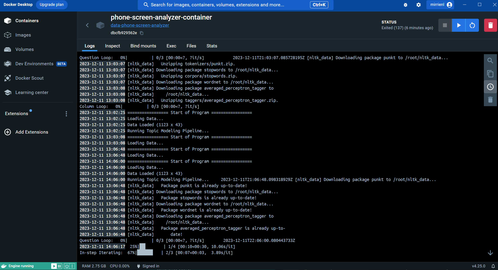
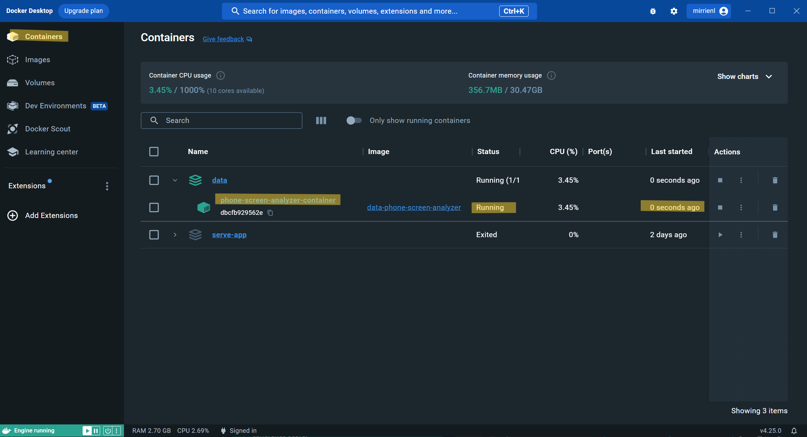

# Glentel Topic Analysis Project
**Last Updated on: December 12, 2023**
### Author
- [Asif Hasan](https://www.linkedin.com/in/asif-hasan-bab759231/)
- [Fiona Lau](https://www.linkedin.com/in/fionalauu/)
- [Mirrien Liang](https://www.linkedin.com/in/mirrien-liang/)
- [Owen Cheuk](http://www.linkedin.com/in/owen-cheuk)

### Description
This is a ***sample*** program resembling the program served for Glentel as an automated tool for analyze open-ended questions, to identify impactful topics, and to predict a target event based on the open-ended questions. In this sample program, we provided simulated raw dataset and the results that we ran on a local machine. The only purpose of sharing this sample program is for educational purposes. For more information, please read [Disclaimer](#disclaimer).

### Features
- **Data Preprocessing**:
    - (Detect language and) Translate
    - Spellcheck
    - Remove punctuation, spaces, digits
    - Remove stop words (predefined and customized)
    - Remove words with less than 2 characters
    - Lemmatize (transform words to its base form)
    - Tokenize (break sentences into single words)
    - Remove duplicated tokens
    - Merge synonyms (based on a configurable and predefined dictionary)
    
    At this step, full sentences are turned into a list of discrete keywords ready for topic modeling.
- **Topic Modeling**:
    - *Topic Extraction*
        - An automated process to determine the number of topic sets/clusters/groups for each open-ended question (in a configurable range defined in the configuration file), and the keywords in each topic.
        - Creates a dictionary for every question, where the keywords corresponding to each topic set (identified by a topic set ID) are mapped for that specific question.
    - *Topic Assignment*
        - Each original response will be labelled by a topic set ID, which corresponds to a list of keywords that most appropriately describes the semantic meanings in the responses.
    - *Evaluation*
        - Ensures the assignments are accurate using a metric of Coherence Score, which evaluates how the assigned topic set ID, or more accurately, the keywords in that topic set ID, are representative.
- **Predictive Models**:
    - *Random Forest*
        - Known for its strength in predictability but weakness in interpretability. Served as a benchmark to compare predictive performance with Logistic Regression.
        - Provides feature (i.e., Question-Topic pairs) importance plot ranked by the Random Forest model as a reference.
        - Provides predictions of a target event based on open-ended inputs.
    - *Logistic Regression*
        - Known for its strength in interpretability but less predictability compared to Random Forest.
        - Inclined to use the logistic regression models as long as they are not performing significantly worse than a random forest.
        - Provides feature importance and significance plot ranked by the logistic regression model.
        - Provides predictions of a target event based on open-ended inputs.

## Table of Contents
- [Project Structure](#Project-structure)
- [Pre-requisites](#pre-requisites)
- [Quickstart](#quickstart)
- [Outputs](#outputs)
- [Disclaimer](#disclaimer)

## Project Structure
The package structure organized as follows:
```
glentel_survey_analysis/
│
├── app.py                            # Main entry point of the application.
│
├── config.py                         # Define global configurations
│
├── data/
│   ├── raw/...                       # Raw survey data.
│   └── processed/...                 # Preprocessed and translated survey data.
│
├── models/
│   ├── lda_model/                    # LDA Model data.
│   ├──   ├── coherence_scores.txt
│   ├──   └── <model_files>...        # Question-specific model files.
│   ├──
│   ├── logistic_model/               # Logistic Regression model data.
│   ├──   ├── correlation_plot.png
│   ├──   ├── feature_importance.png
│   ├──   ├── feature_significance.png
│   ├──   ├── logistic_regression_lift_chart.png
│   ├──   ├── metrics.txt
│   ├──   └── pre_checks_report.txt
│   ├──
│   ├── random_forest/                 # Random Forest model data.
│   ├──   ├── dataset_with_predictions.csv
│   ├──   ├── feature_importance.png
│   ├──   ├── lift_chart.png
│   ├──   ├── metrics.txt
│   ├──   └── model.pkl
│   ├──
│   ├── __init__.py                    # Makes models a Python package.
│   ├── logistic_regression.py         # Logistic Regression logics.
│   ├── random_forest.py               # Random Forest logics.
│   ├── topic_assign.py                # Topic assigning logics.
│   ├── topic_evaluate.py              # Topic extraction accuracy evaluation logics.
│   └── topic_model.py                 # Topic extraction logics.
│
├── results/
│   ├── combined_lift_chart.png
│   ├── feature_significance.png
│   ├── model_report.txt
│   ├── random_forest_feature_importance.png
│   └── <question_dictionaries.txt>    # Question-specific dictionaries
│
├── services/
│   ├── __init__.py                    # Makes services a Python package.
│   ├── data_loader.py                 # Service to load and handle survey data.
│   └── analysis_service.py            # Service to run analysis and generate insights.
│
├── utils/
│   ├── __init__.py                    # Makes utils a Python package.
│   ├── mymemory_translated.py         # Modified module to be copied to the translation package.
│   ├── preprocessing.py               # Text preprocessing utilities.
│   ├── translation.py                 # Language detection and translation utilities.
│   └── spellcheck.py                  # Spellchecking utilities.
│
├── .env.example                       # An environment file template.
│
├── docker-compose.yml                 # Docker Compose configuration file.
|
├── Dockerfile                         # Docker container configuration file.
│
├── requirements.txt                   # All necessary python packages for the project.
│
└── README.md                          # Project description and instructions.
```

## Pre-requisites

### For Docker Users (Recommended):
- **Docker**: [Installed](https://www.docker.com/products/docker-desktop/) and running on your machine.
    - Recommended for portability, consistency, and scalability.

### For Local Environment Users:
- **Python**:
    - Version *3.10.13* or *3.11.3* installed on your machine.

- **Dependencies**:
    - Various packages listed below which can be installed using the provided `requirements.txt`.
        
            nltk==3.8.1
            pandas==2.1.1
            langdetect==1.0.9
            translate==3.6.1
            scikit-learn==1.3.1
            gensim==4.3.2
            numpy==1.26.0
            pyspellchecker==0.7.2
            openpyxl==3.1.2
            tqdm==4.66.1
            matplotlib==3.8.2
            seaborn==0.13.0
            python-dotenv==1.0.0
            
    - Run the following command in your terminal to install all of the Python modules and packages needed:
        ```sh
        pip install -r requirements.txt
        ```

### Common Requirements:

- **Proxy Service for Translation:**
    - This is ***highly recommended*** to ensure quality of translation service without exceeding the free usage limit imposed by the Translation Service Provider.
        - This is not a necessary accessory to have. If no proxy is provided, the translator will attempt to only translate for texts other than English. However, there is a high likelihood of exceeding free usage limit and returning "MAX LIMIT" warning.
    - This program uses Bright Data proxy as our service provider. They have their own methods of managing IP consistency of a session, and we implemented their methods in the preprocessing module.
        - If you are using proxy service providers other than Bright Data, please implement their IP consistency policy in the function `preprocess_data()` function in module `utils/preprocessing.py`.
    - To configure your proxy, create a `.env` file with a template provided in `.env.example`. Input your proxy account information in field `PROXY_HOST`, `PROXY_PORT`, `PROXY_USERNAME`, and `PROXY_PASSWORD`.
    - For Bright Data Proxy, it's recommended to specify your country code by appending `-country-us` or `-country-ca` to your username.

- **Program Configurations:**

    Configurations are available in the `config.py` in the root directory. Please use a code editor (e.g., VS Studio) or a text file editor (by right-clicking and select 'Open with' text file) to open the configuration file.

    For a new dataset, you **must** configure the following items:
    - `RAW_DATA_FILE_PATH`: Please copy the relative or absolute file path to your raw dataset. Accepting only Excel Spreadsheet or CSV.

    - `TO_PREPROCESS_DATA`: If dataset has not been preprocessed yet, set to True. If it has been preprocessed and needs no further attempts, set to False

    - `TO_TRANSLATE`: Set True if you have responses to translate.

    - `HAS_PROXY`: Set True if you have a proxy for translating service. If so, follow the previous instructions on how to set up proxy properly.

    - `TO_EXTRACT_TOPICS`: Set True if you need to run the topic extraction pipeline (Extraction -> Assignment -> Evaluation).

    - `COLUMNS_OF_INTEREST`: Please copy paste the name of open-ended questions you want to analyze, separated by commas. Please ensure the names are identical to those in the raw data.

    - `RESPONSE_COLUMN`: Please copy paste the name of the target question/response you want to tie the open-ended questions to.

    - `RESPONSE_COLUMN_LEVEL`: Please specify the level names (or a unique keyword in those levels, such as "Yes" and "No") of the target question with the level of interest in the front.
    
    You might **optionally** consider adjusting the following items:
    - `CUSTOM_STOPWORDS`: Please adjust keywords that you feel irrelevant during the topic extraction. They are in addition to common English stopwords (provided by NLTK data).

    - `CUSTOM_SYNONYMS_DICT`: Please adjust sysnonyms that need to be merged following the format of a set of examples given.

    You might be interested to configure the following items with extra **caution**:
    - `NUM_OF_TOPIC_START`: for each open-ended question, enter your desired number of topic sets you want the model to start fitting. Generally, you want to start with 2 or 3 when you believe an open-ended question has possibly a narrow domain of topics (e.g., a question where the responses are only discussing either Topic A or Topic B).

    - `NUM_OF_TOPIC_STOP`: for each open-ended question, enter your desired number of topic sets you want the model to start fitting. Similarly, if you believe the question has a broader possible topic range, please increase the number accordingly. Usually, a number less than 20 is recommended to maintain the level of interpretability.

    - `STEP_SIZE`: Between the previous two numbers, define the step size you want the program to attempt fitting. For example, if you want to fit a number of topics in sequence `[1,3,5,7]`, you are starting at 1, stopping at 7, with a step size of 2.

    - `NUM_OF_TRAIN_PER_STEP`: for each `num_topic` argument used to train an LDA model, specify how many iterations you want to train with this argument. The program will pick the best model in this iteration. Please pay attention to the exponential growth in time consumption when you increase the values of this option.

    - `NUM_OF_PASSES`: for each question, specify how many number of passes through the corpus in its LDA model you want to pass to (default at `25`).

    - `CLEANED_DATA_FILE_PATH`: No need to adjust.

    - `TOPIC_ASSIGNMENT_FILE_PATH`: No need to adjust.

    - `PROCESSED_DATA_FILE_PATH`: No need to adjust.


## Quickstart

This section will guide you through the steps to get running quickly after you have fulfilled all the prerequisites detailed in the [Prerequisites](#pre-requisites) section.

### For Docker Users:

1. **Build and Run the Container**:
    - Open a terminal at the application's root directory.
    - Execute the command: `docker-compose up --build`
        - The `--build` flag ensures that Docker builds the image before starting the container, which is essential for the first run or when changes are made to the Dockerfile and Docker Compose config file.
        - (Optionally) Add `--detach` flag runs the container in the background.
2. **Verify App Status**:
    - After the container is up, you can verify that the app is live and running by:
        - Using Docker CLI commands: `docker ps` to see running containers and `docker logs <container_name>` to check the logs of your server container.
        - Checking the container's status in Docker Desktop's UI.
            
            
3. **Subsequent Usage**:
    - In Terminal:
        - To stop and remove the container, run `docker-compose down`
        - To run in a new container, run `docker-compose up`
        - To just stop the container, run `docker-compose stop`
        - To start a stopped container, run `docker-compose start`
    - In Docker Desktop's UI:
        - Navigate to *Container* in the sidebar and you will find all tools to manage the container.

### For Local Environment Users:

1. **Start the App**:
    - Run in terminal `python app.py`.

## Outputs

All results will be stored in `results/` folder in the root directory, including:
- Question-specific dictionaries found as `<question_name>_topic_dictionary.txt` where you can look up the keywords associated to a Topic Set ID for a question.
- A summary of model performance in file `model_report.txt`.
- A visualization of comparing the predictive power of the Random Forest and Logistic Regression in image `combined_lift_chart.png`.
- A visualization of ranking the impact size of Question-Topic pairs produced by Logistic Regression model in image `feature_significance.png`.
- A visualization of ranking the importance level of Question-Topic pairs produced by Random Forest model in image `random_forest_feature_importance.png`.

Due to the NDA, please refer to the slide deck that was utilized in the project's final presentation on December 11, 2023, for specific examples.

## Disclaimer

This program is developed by SFU x Glentel Team (Fall 2023) exclusively for internal use within Glentel. It is intended for authorized employees and stakeholders to analyze data for legitimate business purposes. The program may be publicly showcased solely for the purpose of displaying skills, provided that all sensitive data has been removed in strict accordance with the terms defined by the NDA signed between SFU x Glentel Team and Glentel.

Unauthorized distribution or sharing of this program is strictly prohibited. The usage of this program for any illegal, unethical, or malicious activities is not permitted. Users are responsible for complying with all relevant laws and regulations while using this program.

SFU and Glentel do not take any responsibility for the misuse or unauthorized usage of this program by any individual or entity.
The program is provided "as is," and SFU and Glentel make no warranties or guarantees regarding its functionality or accuracy.
By running this program or using any of its features, you acknowledge that you have read and agreed to the terms and conditions stated in this section.

For any questions or concerns regarding the usage of this program, please contact the authors.